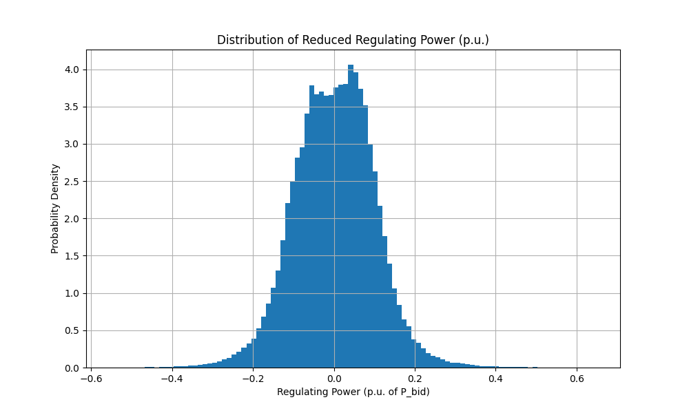
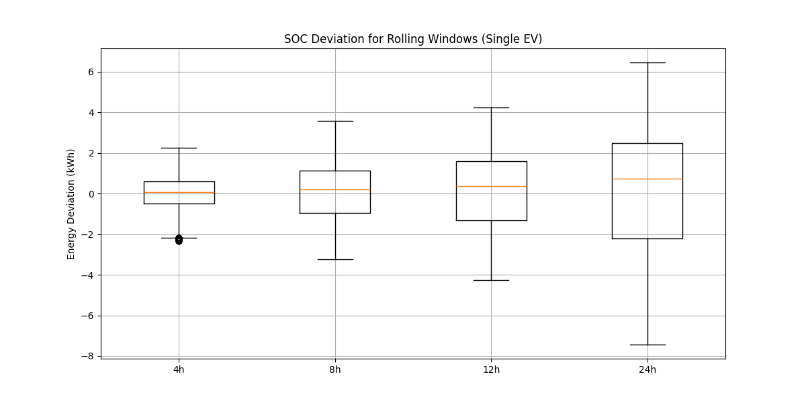
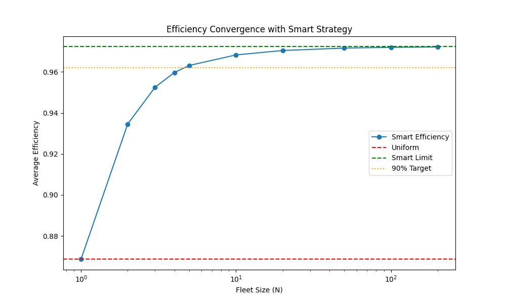

# Smart Fleet Participation in FCR - Project Report

This report analyzes the technical and economic feasibility of an Electric Vehicle (EV) fleet participating in the Primary Frequency Control (FCR) market in France.

## Q1: Frequency & Reduced Regulating Power

**Question:** Plot the distribution of the reduced regulating power $y_{red}$ expected by the TSO.

The reduced regulating power is defined as:
$$ y_{red}(t) = \frac{P_{RE}(t)}{P_{bid}} = 5 \times (f(t) - 50) $$

Using the frequency data for January 2021 (tiled from May 2019 data), the distribution is shown below:

## Q2: Magnitude Observations

**Question:** What observation can you make regarding the magnitude of the regulating power?

**Observation:**
The distribution of the reduced regulating power is centered around 0 p.u., reflecting the stable nature of the grid frequency which oscillates around 50 Hz.
*   **Range:** The signal rarely reaches the maximum limits ($\pm 1$ p.u.). The maximum observed positive deviation is approximately **+0.65 p.u.** and the minimum is **-0.55 p.u.**
*   **Implication:** The EV battery is rarely requested to deliver its full power ($P_{max}$). Most of the time, the power request is low (< 0.2 p.u.), which implies that without specific management, the chargers (OBC) might operate in low-efficiency regions.

## Q3: SOC Deviation (Rolling Windows)

**Question:** Plot the SOC deviation induced by FCR for rolling windows of 4h, 8h, 12h, and 24h.

Assuming a single vehicle with a 40 kWh battery and 7 kW charger ($P_{bid} \approx 6.4$ kW), the energy drift (integral of power) over different time windows is analyzed:

*   **4h Window:** Deviations are small, typically within $\pm 2.3$ kWh.
*   **24h Window:** Deviations can reach up to **-7.44 kWh** (discharge) or **+6.45 kWh** (charge).

## Q4: Feasibility for EVs

**Question:** Is it reasonable for an EV to participate in FCR for these periods?

**Conclusion:** **Yes, it is reasonable**, but with conditions.
*   **Capacity:** A deviation of ~7.5 kWh represents approximately **19%** of a standard 40 kWh battery capacity.
*   **Constraints:** As long as the EV does not arrive with a very low State of Charge (< 20%) or extremely high SOC (> 80%), it can sustain a 24-hour service session without hitting energy limits.
*   **Management:** For longer durations, an energy management strategy (restoration) would be required to prevent the SOC from drifting too close to the boundaries.

## Q5: Uniform Strategy Efficiency

**Question:** Compute the average efficiency of the fleet with the "Uniform" strategy.

In the **Uniform Strategy**, the total power request is distributed evenly among all available vehicles ($P_{car} = P_{total} / N$). Since the average power request is low, individual chargers often operate at partial load where efficiency is poor.

*   **Average Efficiency ($\eta_{uniform}$):** **86.87%**

## Q6: Smart Strategy & Limits

**Question:** What is the limit of average efficiency $\eta_{smart}^{\infty}$? What is the minimum number of EVs $N_0$ for 90% benefits?

**Smart Strategy:**
This strategy minimizes conversion losses by concentrating the power request on a minimal number of vehicles operating near their optimal efficiency point ($P_{opt} \approx 4.7$ kW to $7.0$ kW), while keeping the rest of the fleet idle.

**Results:**
*   **Efficiency Limit ($\eta_{smart}^{\infty}$):** **97.23%** (Theoretical max efficiency of the charger).
*   **Convergence:** The efficiency improves rapidly as the fleet size $N$ increases.
*   **$N_0$ (90% Benefit):** **5 EVs**.
    *   With just 5 vehicles available, the aggregator can achieve an average efficiency of **96.31%**, capturing most of the theoretical gain.

## Summary of Economics (Jan 2021)

While efficiency is a key technical metric, the economic viability depends on revenue vs. battery aging costs.

| Metric | Uniform Strategy | Smart Strategy |
| :--- | :--- | :--- |
| **Total Revenue** | **11,118.55 EUR** | **11,118.55 EUR** |
| Energy Throughput | 51,728 kWh | 48,719 kWh |
| Aging Cost | 1,293.21 EUR | 1,217.96 EUR |
| **Net Profit** | **9,825.35 EUR** | **9,900.59 EUR** |

The **Smart Strategy** reduces energy throughput by ~6% due to better efficiency, resulting in lower aging costs and slightly higher profits.
