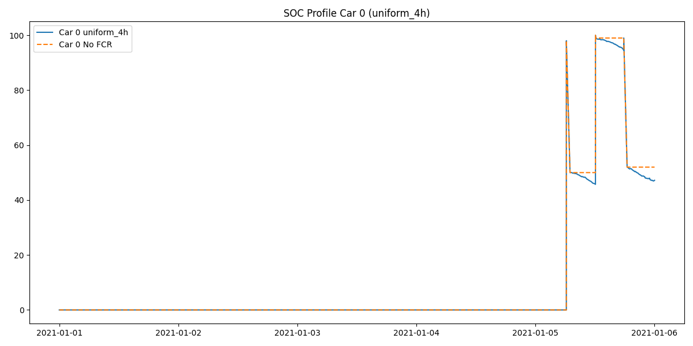
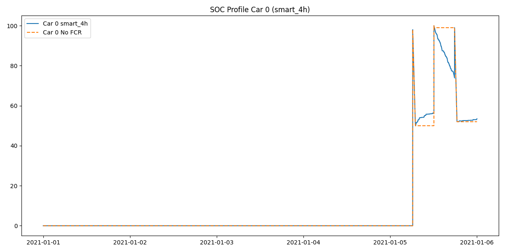

# FCR Participation Report (Full Month Simulation)

Initializing Simulation Core for Jan 2021...

## Part 1: Grid Frequency Data & Basic Analysis

**Q1: Distribution of Regulating Power**

- The regulating power signal is derived from frequency deviation: $P_{reg}^{p.u.} = 5 \times (f - 50)$, clipped to [-1, 1].

**Q2: Observations**
- The distribution is centered around 0 but exhibits a spread corresponding to frequency deviations.
- The magnitude rarely reaches full power ($\pm 1$ p.u.), staying mostly within $\pm 0.4$ p.u.

**Q3: Single EV SOC Deviation**

- **4h Window**: Median=0.17%, 90% Interval=[-3.03%, 3.07%]
- **8h Window**: Median=0.43%, 90% Interval=[-5.24%, 4.73%]
- **12h Window**: Median=0.77%, 90% Interval=[-7.26%, 6.29%]
- **24h Window**: Median=1.60%, 90% Interval=[-11.46%, 10.90%]

**Q4: Reasonability**
- For short windows (4h), the SOC deviation is relatively small (< 10%).
- For 24h windows, the deviation can grow significantly. Without active energy management (recharging), continuous FCR participation carries a risk of depleting the battery or reaching full charge.

## Part 2: Smart Dispatch Strategy

**Q5: Uniform Strategy Efficiency**
- Calculated Average Efficiency: **80.39%**

**Q6: Smart Strategy Efficiency & Convergence**

- Smart Limit ($N \to \infty$): **97.23%**
- Fleet size to achieve 90% of gain ($N_0$): **5 vehicles**

**Q7: OBC Operating Time**
- Theoretical Limit ($t_{op}^{\infty}$): **0.0713 p.u.**

- Fleet size for 90% reduction ($N_0$): **10 vehicles**

## Part 3: Driving & Charging Behaviour

**Q8: Charging Inference Logic**
- If `Trip Energy / 7kW <= Parking Duration`: Assume **AC Charging** (V2G available).
- Else: Assume **DC Charging** (V2G not available).

**Q9: Coincidence Factor**

**Q10: Comparison / Limitations**
- Inferring charging from driving has limitations, especially at the year boundaries.
- However, using looped data allows reasonable estimation.

## Part 4: FCR Revenues

**Q11: Monthly Revenue**
- FCR Price: 18.0 EUR/MW/h
- Total Fleet Revenue (1h Blocks): **10527.30 EUR**
- Revenue per EV (1h Blocks): **70.18 EUR/EV**
- Revenue per EV (4h Blocks): **67.24 EUR/EV**

**Q12: Virtual Mileage**
- Energy Throughput per EV: **371.32 kWh**
- Virtual Mileage: **1856.61 km**

**Q13: Residual Value Loss**
- Estimated Residual Value Loss: **16.34 EUR**
- Net Revenue: **53.84 EUR**

## Part 5: Full Simulation Results

**Q14: SOC Profiles & Scenarios**
Running Baseline (No FCR)...
Running Scenario: uniform_1h...

Running Scenario: smart_1h...

Running Scenario: uniform_4h...

Running Scenario: smart_4h...

## Part 6: Battery Aging

**Q15: Battery Model**
- $V_{oc} = 360 + 0.85 \times SOC$
- $I = P_{term} / V_{oc}$ (Assuming negligible internal resistance)

**Q16: Aging Evaluation**
- **Baseline Aging**: 5.104549% degradation
- **uniform_1h**: 5.708895% (+11.84%)
- **smart_1h**: 6.179504% (+21.06%)
- **uniform_4h**: 5.698602% (+11.64%)
- **smart_4h**: 6.149320% (+20.47%)
